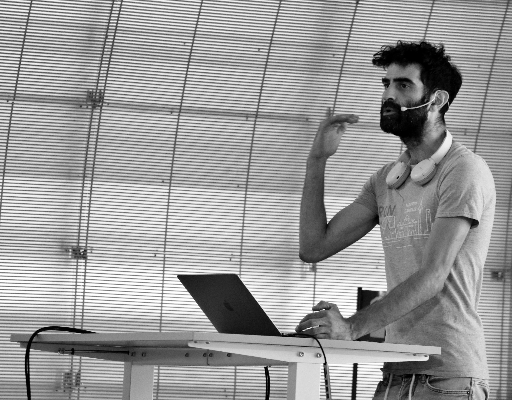

# WeBuild | Chazam sound app 

## Proceso de instalación

En la carpeta `chazam` está la librería para hacer `pip install .` o ejecutar `python setup.py` y realizar la instalación.

# Uso

En la carpeta `notebooks` está todo el proceso completo, desde la descarga de audio desde YouTube hasta el reconocimiento de las canciones. En la carpeta `api` está el código necesario para subir al servidor y poder realizar las llamadas. En la carpeta de `presentación chazam` está el código usado durante el evento.

**Enjoy!**

[Linkedin Yonatan](https://www.linkedin.com/in/yonatan-rodriguez/)

